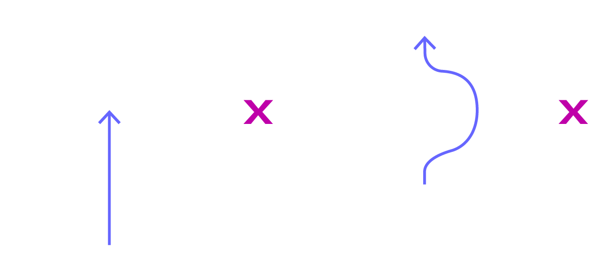
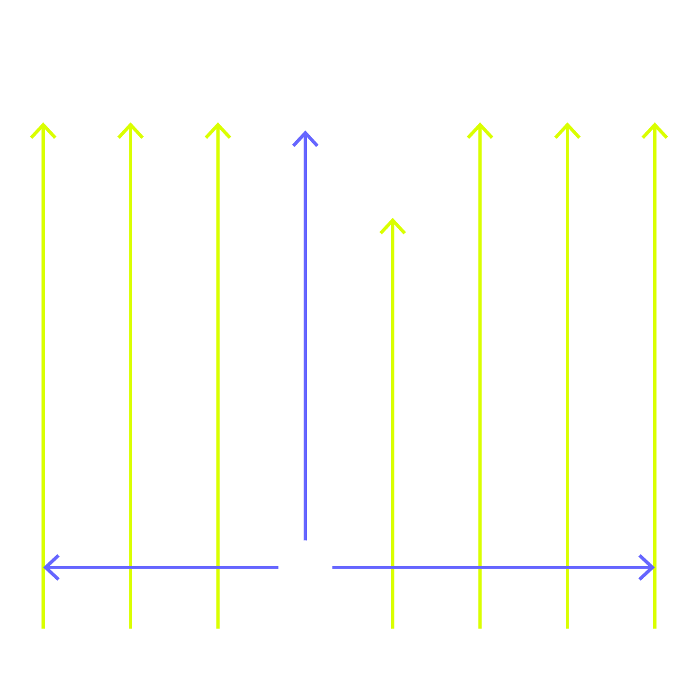
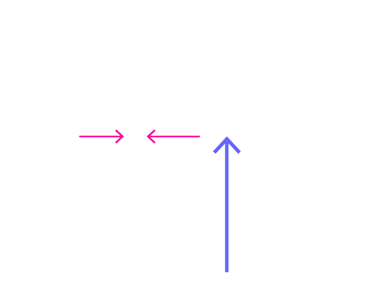
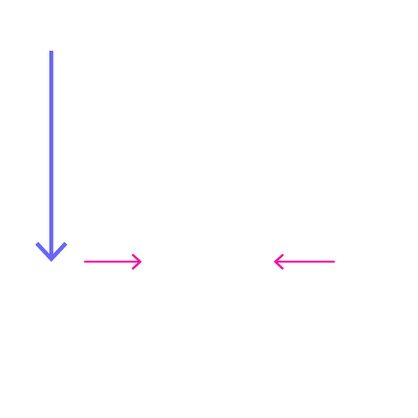
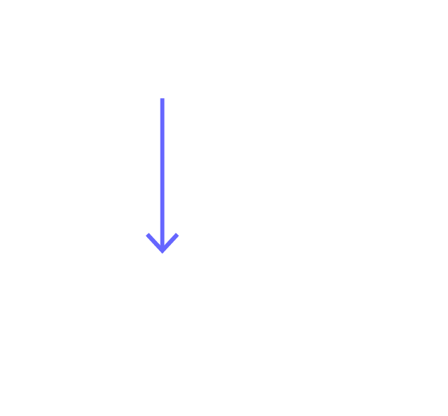

<h1 align="center">Petteia Bot</h1>
<p align="center">

</p>
<h6 align="center"><b><i>v0.1</i></b> - Currently in development<br/>
<b>Last updated:</b> February 11, 2022
</h6>

## Description

A simple program to play the ancient Greek game of Petteia.
The program may be played in two modes: either with a human player v. computer player or two computer players against
each other. 

While the game is set up to have a UI to monitor the state of the game, 
this program is intended for further expansion for use in a robotic application in which a robot plays
the game with physical pieces. The game engine is set up as a Module in order to
simplify implementation for this, where the actual game interface and engine may be imported and operated separately.

---
### Table of Contents
- [Petteia Bot](#petteia-bot)
  * [Description](#description)
  <br/><br/>
  * [**Getting Started**](#getting-started)
    + [Dependencies](#dependencies)
    + [Installing](#installing)
    + *Executing the program* [Not available currently]
<br/><br/>
  * [About the Game](#about-the-game)
    + [**Rules of Petteia**](#rules-of-petteia)
<br/><br/>
  * [*Author & Contact*](#author-and-contact)
  * [*Version History*](#version-history)
---
<!--
## Getting Started

### Dependencies
- Python 3.8.9
- **pygame** handles the UI render and is required for running the program in its current state. *Testing was done using pygame version 2.1.2 and therefore may not be compatible with other versions of the library*


### Installing

* If you have not already done so, install Python version 3.8.9 using homebrew```brew install python@3.8.9```
* Once brew is done installing Python, you may check the version using the following command:
```python -V```
* Next, install Python Virtual Environment / venv with the following command
```python3.9 -m pip install --user virtualenv```
* Substitute the placeholder path with the path to your desired working directory, then run these commands to copy the entire repository to a subdirectory
```
cd path/to/dir
git clone https://github.com/13comte/petteia-bot.git
```
* Navigate to the directory for the repo
```cd /petteia-bot```
* Create a virtual environment to run the program with by running this command
```python3 -m venv path/to/dir/petteia-bot```
* Launch the new virtual environment

* Install the program dependencies
```pip install -r requirements.txt```

### Executing program
!!! SECTION TO BE COMPLETED SOON !!!
* If you do not already have Python installed on your computer, download the appropriate file for your operating system at the following link:
  * 


* Create a virtual environment to run the program with by running this command
```
python3 -m venv /path/to/new/virtual/environment
```
-->

-----
## About the Game
### Rules of Petteia
This is a brief introduction to Petteia -- <br/>For a more comprehensive history of petteia and its Roman counterpart,
[see this article on Chess.com](https://www.chess.com/blog/introuble2/petteia-polis-ludus-latrunculorum-as-partially-chess-ancestors#B22)

|                                                             Diagram 	                                                              |           # 	            |                                                                 Rule 	                                                                 |
|:----------------------------------------------------------------------------------------------------------------------------------:|:------------------------:|:--------------------------------------------------------------------------------------------------------------------------------------:|
|                         |  <b><i>Rule 1</i></b> 	  |                   Petteia is played on a grid, much like chess or checkers, however, this grid may be of any size 	                    |
|           	          | <b><i> Rule 2 </i></b> 	 |                                     A player places his pieces in the row nearest to his/herself 	                                     |
|            	           | <b><i> Rule 3 </i></b> 	 |                                        A piece cannot land atop another or jump over another 	                                         |
|             	           | <b><i> Rule 4 </i></b> 	 |                Each piece can move as far as the player desires in a straight line, both horizontally and vertically 	                 |
|          	       | <b><i> Rule 5 </i></b> 	 |                        The opponent’s piece is captured by trapping it between two of the player’s own pieces 	                        |
|   	 | <b><i> Rule 6 </i></b> 	 |                             If a moving piece traps multiple enemy pieces, then all of them are captured 	                             |
|                	             | <b><i> Rule 7 </i></b> 	 |           It is allowed for a piece to place itself <b><i>voluntarily</i></b> between two enemy pieces <b>without harm</b> 	           |
|                                                                 	                                                                  | <b><i> Rule 8 </i></b> 	 | The game ends once one of the players is left with a <b>single piece</b> and is no longer able to attack the opponent<br/><br/><br/> 	 |
|                                                                 	                                                                  | <b><i> Rule 9 </i></b> 	 |                                If the game has no apparent conclusion, a  <b>draw</b> may be decreed 	                                 |


<br/>

---
----
## Author and Contact
Tommy Lecomte  
 [@13comte](https://www.instagram.com/13comte/)

## Version History

* 0.1
    * Initial Commit
